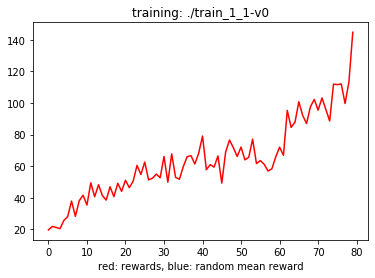

supermario-dqn
==============

Deep Reinforcement Learning Agent for Super Mario Bros using OpenAI gym
[gym-super-mario-bros](https://github.com/Kautenja/gym-super-mario-bros) environment

## Usage

~~~shell

# create virtual env in the project folder
$ python3 -m venv .venv
$ source .venv/bin/activate

# install dependencies
$ pip3 install -r requirements

# use
$ supermario_train -h
usage: supermario_train [-h] [--batch_size BATCH_SIZE]
                        [--fit_interval FIT_INTERVAL] [--gamma GAMMA]
                        [--eps_start EPS_START] [--eps_end EPS_END]
                        [--eps_decay EPS_DECAY]
                        [--target_update TARGET_UPDATE]
                        [--save_path SAVE_PATH] [--memory_size MEMORY_SIZE]
                        [--num_episodes NUM_EPISODES] [--resume RESUME]
                        [--checkpoint CHECKPOINT] [--random] [--render]
                        [--world_stage WORLD_STAGE WORLD_STAGE]
                        [--actions ACTIONS] [--test TEST] [--log]
                        [--algorithm ALGORITHM]

Handle training

optional arguments:
  -h, --help            show this help message and exit
  --batch_size BATCH_SIZE
                        size of each batch used for training
  --fit_interval FIT_INTERVAL
                        fit every `fit_interval` examples available
  --gamma GAMMA         discount rate used for Q-values learning
  --eps_start EPS_START
                        start probability to choose a random action
  --eps_end EPS_END     end probability to choose a random action
  --eps_decay EPS_DECAY
                        decay of eps probabilities
  --target_update TARGET_UPDATE
                        number of episodes between each target dqn update
  --save_path SAVE_PATH
                        where save trained model
  --memory_size MEMORY_SIZE
                        size of replay memory
  --num_episodes NUM_EPISODES
                        number of games to be played before end
  --resume RESUME       load from a checkpoint
  --checkpoint CHECKPOINT
                        number of episodes between each network checkpoint
  --random              choose randomly different worlds and stages
  --render              rendering of frames, only for debug
  --world_stage WORLD_STAGE WORLD_STAGE
                        select specific world and stage
  --actions ACTIONS     select actions used between ["simple"]
  --test TEST           each `test` episodes network is used and tested over
                        an episode
  --log                 logs episodes results
  --algorithm ALGORITHM
                        algorithm used for training, 'double' DQN by default but
                        is also possible to use simple "deep"

# play
$ supermario_play -h
usage: play a game [-h] [--world_stage WORLD_STAGE WORLD_STAGE] [--skip SKIP]
                   [--processed]
                   model

positional arguments:
  model                 neural network model

optional arguments:
  -h, --help            show this help message and exit
  --world_stage WORLD_STAGE WORLD_STAGE
                        select a specific world and stage, world in [1..8],
                        stage in [1..4]
  --skip SKIP           number of frames to skip
  --processed           shows frames processed for neural network
~~~

## Reward Function

The reward function used takes into account the game score, how much Mario moves 
to the right, Mario status and penalizes deaths.

## Neural Network Model

For training is used plain Double DQN with simple random replay memory and a network composed by 3 CNN layers and a FC 512 neurons layer

## Action space

'right', 'right A B', 'right A', 'left'

## Example results

After a training of 3-4h with an i9-9900K and a GeForce 2080 on the first stage of the first level Mario achieves the
flag:

